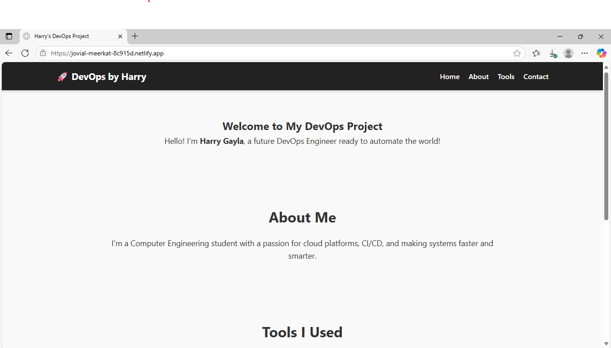

# 🚀 Harry's DevOps Project

Welcome to my **DevOps Portfolio Project**!  
This is a simple static website built with **HTML & CSS**, and deployed using **Netlify's built-in CI/CD**.

> 💻 Future DevOps Engineer | Passionate about Cloud, Automation, and Continuous Deployment!

---

## 🔗 Live Website

🌐 [Visit Site](https://jovial-meerkat-8c915d.netlify.app/)  

---

## 📸 Screenshot

---

## ⚙️ Built With

- 🧱 **HTML** — Structure of the site  
- 🎨 **CSS** — Styling and layout  
- ☁️ **Netlify** — Free hosting & CI/CD  
- 🧰 **GitHub** — Source control & auto-deploy

